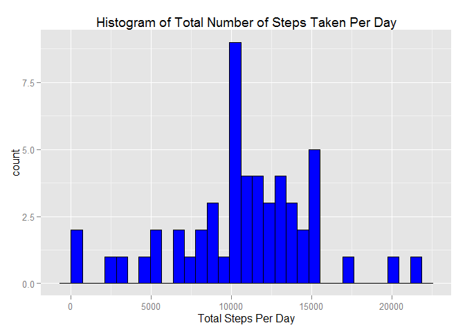
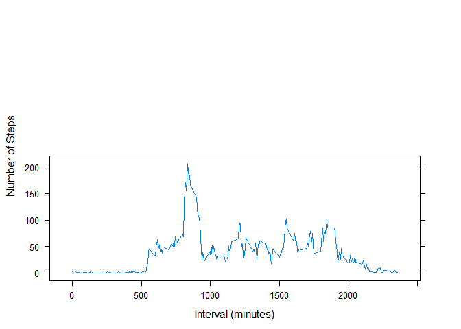
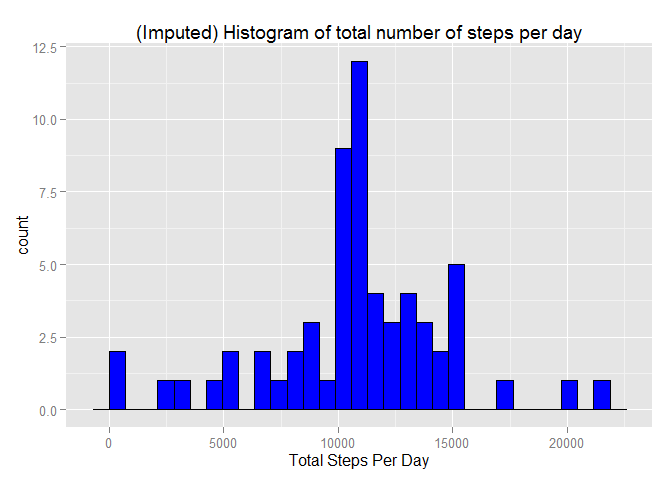
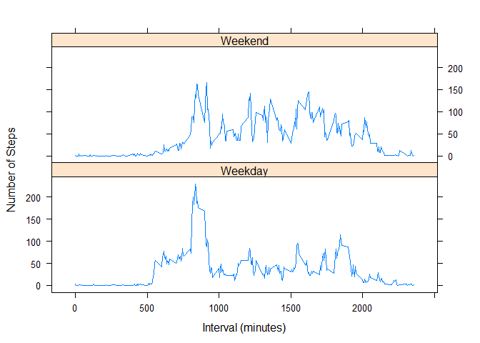

# Reproducible Research: Peer Assessment 1


## Loading and preprocessing the data
1. Load the data (i.e. read.csv())
2. Process/transform the data (if necessary) into a format suitable for your analysis

```r
library(knitr)
library(ggplot2)
file<-"./activity.csv"
MyData<-read.csv(file, header = TRUE, sep= ",")
```


## What is mean total number of steps taken per day?
3. For this part of the assignment, you can ignore the missing values in the dataset.


```r
complete_data<-na.omit(MyData) #data with NA's removed
```


4. Calculate the total number of steps taken per day

```r
dailysteps<-aggregate(steps ~ date, complete_data, sum)
dailysteps
```

```
##          date steps
## 1  2012-10-02   126
## 2  2012-10-03 11352
## 3  2012-10-04 12116
## 4  2012-10-05 13294
## 5  2012-10-06 15420
## 6  2012-10-07 11015
## 7  2012-10-09 12811
## 8  2012-10-10  9900
## 9  2012-10-11 10304
## 10 2012-10-12 17382
## 11 2012-10-13 12426
## 12 2012-10-14 15098
## 13 2012-10-15 10139
## 14 2012-10-16 15084
## 15 2012-10-17 13452
## 16 2012-10-18 10056
## 17 2012-10-19 11829
## 18 2012-10-20 10395
## 19 2012-10-21  8821
## 20 2012-10-22 13460
## 21 2012-10-23  8918
## 22 2012-10-24  8355
## 23 2012-10-25  2492
## 24 2012-10-26  6778
## 25 2012-10-27 10119
## 26 2012-10-28 11458
## 27 2012-10-29  5018
## 28 2012-10-30  9819
## 29 2012-10-31 15414
## 30 2012-11-02 10600
## 31 2012-11-03 10571
## 32 2012-11-05 10439
## 33 2012-11-06  8334
## 34 2012-11-07 12883
## 35 2012-11-08  3219
## 36 2012-11-11 12608
## 37 2012-11-12 10765
## 38 2012-11-13  7336
## 39 2012-11-15    41
## 40 2012-11-16  5441
## 41 2012-11-17 14339
## 42 2012-11-18 15110
## 43 2012-11-19  8841
## 44 2012-11-20  4472
## 45 2012-11-21 12787
## 46 2012-11-22 20427
## 47 2012-11-23 21194
## 48 2012-11-24 14478
## 49 2012-11-25 11834
## 50 2012-11-26 11162
## 51 2012-11-27 13646
## 52 2012-11-28 10183
## 53 2012-11-29  7047
```

5. If you do not understand the difference between a histogram and a barplot, research the difference between them. Make a histogram of the total number of steps taken each day


```r
ggplot(dailysteps, aes(x=steps)) + geom_histogram(fill="blue", color="black")+ggtitle("Histogram of Total Number of Steps Taken Per Day") +xlab("Total Steps Per Day")
```

 


6. Calculate and report the mean and median of the total number of steps taken per day


```r
dailyaverage<-aggregate(steps ~ date, complete_data, mean)
medianofstepsbyday <- median(dailysteps$steps)
dailyaverage
```

```
##          date      steps
## 1  2012-10-02  0.4375000
## 2  2012-10-03 39.4166667
## 3  2012-10-04 42.0694444
## 4  2012-10-05 46.1597222
## 5  2012-10-06 53.5416667
## 6  2012-10-07 38.2465278
## 7  2012-10-09 44.4826389
## 8  2012-10-10 34.3750000
## 9  2012-10-11 35.7777778
## 10 2012-10-12 60.3541667
## 11 2012-10-13 43.1458333
## 12 2012-10-14 52.4236111
## 13 2012-10-15 35.2048611
## 14 2012-10-16 52.3750000
## 15 2012-10-17 46.7083333
## 16 2012-10-18 34.9166667
## 17 2012-10-19 41.0729167
## 18 2012-10-20 36.0937500
## 19 2012-10-21 30.6284722
## 20 2012-10-22 46.7361111
## 21 2012-10-23 30.9652778
## 22 2012-10-24 29.0104167
## 23 2012-10-25  8.6527778
## 24 2012-10-26 23.5347222
## 25 2012-10-27 35.1354167
## 26 2012-10-28 39.7847222
## 27 2012-10-29 17.4236111
## 28 2012-10-30 34.0937500
## 29 2012-10-31 53.5208333
## 30 2012-11-02 36.8055556
## 31 2012-11-03 36.7048611
## 32 2012-11-05 36.2465278
## 33 2012-11-06 28.9375000
## 34 2012-11-07 44.7326389
## 35 2012-11-08 11.1770833
## 36 2012-11-11 43.7777778
## 37 2012-11-12 37.3784722
## 38 2012-11-13 25.4722222
## 39 2012-11-15  0.1423611
## 40 2012-11-16 18.8923611
## 41 2012-11-17 49.7881944
## 42 2012-11-18 52.4652778
## 43 2012-11-19 30.6979167
## 44 2012-11-20 15.5277778
## 45 2012-11-21 44.3993056
## 46 2012-11-22 70.9270833
## 47 2012-11-23 73.5902778
## 48 2012-11-24 50.2708333
## 49 2012-11-25 41.0902778
## 50 2012-11-26 38.7569444
## 51 2012-11-27 47.3819444
## 52 2012-11-28 35.3576389
## 53 2012-11-29 24.4687500
```

```r
medianofstepsbyday
```

```
## [1] 10765
```


## What is the average daily activity pattern?
7. Make a time series plot (i.e. type = "l") of the 5-minute interval (x-axis) and the average number of steps taken, averaged across all days (y-axis)
    a) Split data by intervals.
    b) Calculate average of steps in each 5 minutes interval.
    c) Plot 5-minute interval (x-axis) and the average number of steps taken,     averaged across all days (y-axis).
   

```r
library("lattice")

dailyInterval<-aggregate(steps ~ interval, complete_data, mean)


xyplot(
  type="l",
  data=dailyInterval,
  steps~interval  ,
  xlab="Interval (minutes)",
  ylab="Number of Steps",
  layout=c(1,2))
```

 


8. Which 5-minute interval, on average across all the days in the dataset, contains the maximum number of steps?

```r
with(dailyInterval,interval[which.max(steps)])
```

```
## [1] 835
```


## Imputing missing values
Note that there are a number of days/intervals where there are missing values (coded as NA). The presence of missing days may introduce bias into some calculations or summaries of the data.


9. Calculate and report the total number of missing values in the dataset (i.e. the total number of rows with NAs)


```r
dataSet_NA<- sum(!complete.cases(MyData))
dataSet_NA
```

```
## [1] 2304
```


10. Devise a strategy for filling in all of the missing values in the dataset. The strategy does not need to be sophisticated. For example, you could use the mean/median for that day, or the mean for that 5-minute interval, etc.

11. Create a new dataset that is equal to the original dataset but with the missing data filled in.

12. Make a histogram of the total number of steps taken each day and Calculate and report the mean and median total number of steps taken per day. Do these values differ from the estimates from the first part of the assignment? What is the impact of imputing missing data on the estimates of the total daily number of steps?


```r
# perform the imputation
datafull<-MyData
nas<-is.na(datafull$steps)
avg_interval<-tapply (datafull$steps, datafull$interval, mean, na.rm=TRUE, simplify=TRUE) #return mean of steps by interval while ignoring Nas as a vector
datafull$steps[nas]<-avg_interval[as.character(datafull$interval[nas])]
NoofNas<-sum(is.na(datafull$steps)) #to check for no of Nas in new dataset
NoofNas
```

```
## [1] 0
```

```r
# aggregate steps as per date to get total number of steps in a day
date_steps_imputed <- aggregate(steps ~ date, datafull, sum)


# create histogram of total number of steps in a day
ggplot(date_steps_imputed, aes(x=steps)) + geom_histogram(fill="blue", color="black")+ggtitle("(Imputed) Histogram of total number of steps per day") +xlab("Total Steps Per Day")
```

 

```r
# get mean and median of total number of steps per day
mean(date_steps_imputed$steps)
```

```
## [1] 10766.19
```

```r
median(date_steps_imputed$steps)
```

```
## [1] 10766.19
```

```r
# get mean and median of total number of steps per day for data with NA's removed
mean(dailysteps$steps)
```

```
## [1] 10766.19
```

```r
median(dailysteps$steps)
```

```
## [1] 10765
```


## Are there differences in activity patterns between weekdays and weekends?
For this part the weekdays() function may be of some help here. Use the dataset with the filled-in missing values for this part.

13. Create a new factor variable in the dataset with two levels - "weekday" and "weekend" indicating whether a given date is a weekday or weekend day.

```r
df<-datafull
# convert date from string to Date class
df$date <- as.Date(df$date, "%Y-%m-%d")

# add a new column indicating day of the week 
df$day <- weekdays(df$date)

#compare Day with  a list ("SUNDAY", "SATURDAY")
df$DayType<-factor(df$day) #copy a new column to factor 
levels(df$DayType)<- list(
  Weekday=c("Monday", "Tuesday", "Wednesday", "Thursday","Friday"),
  Weekend = c("Saturday", "Sunday") #rename DayType to weekday or weekend
  )
#df
```


14. Make a panel plot containing a time series plot (i.e. type = "l") of the 5-minute interval (x-axis) and the average number of steps taken, averaged across all weekday days or weekend days (y-axis).

```r
dayTypeInterval<-aggregate(steps~interval+ DayType , data=df,FUN= mean)
#dayTypeInterval
xyplot(
  type="l",
  data=dayTypeInterval,
  steps~interval |DayType  ,
  xlab="Interval (minutes)",
  ylab="Number of Steps",
  layout=c(1,2))
```

 


## What is mean total number of steps taken per day?


## What is the average daily activity pattern?


## Imputing missing values


## Are there differences in activity patterns between weekdays and weekends?
